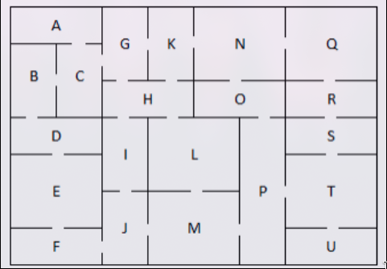

# Maze
Consider an environment consisting of 21 rooms identified by the letters A to U, connected by doors and separated by walls, as shown in Figure 1. The objective is to implement a program that allows a robot to navigate between two rooms, starting from an initial room until reaching a final room, respecting the physical restrictions of the environment.



to write on terminal there will be on another way using this chars:
```bash
│ ─ ┌ ┐ └ ┘ ├ ┤ ┬ ┴ ┼
```

to write this:

```bash
┌───┬─┬─┬───┬───┐
│AAA│G│K│NNN│QQQ│
├─┬ ┤G K NNN QQQ│
│B│C G│K│NNN│QQQ│
│B C├ ┴ ┼─ ─┼─ ─┤
│B│C│HHH│OOO│RRR│
├ ┴─┼ ┬ ┴─┬ ┼─ ─┤
│DDD│I│LLL│P│SSS│
├─ ─┤I│LLL│P├─ ─┤
│EEE│I│LLL│P│TTT│
│EEE├ ┼─ ─┤P TTT│
│EEE│J│MMM│P│TTT│
├─ ─┤J MMM P├─ ─┤
│FFF J│MMM│P│UUU│
└───┴─┴───┴─┴───┘
```

to algorithms that are required some height on each door will use this table:

| room 1 | room 2 | height |
| ------ | ------ | ------ |
| A      | C      | 5      |
| B      | C      | 2      |
| B      | D      | 4      |
| C      | A      | 5      |
| C      | B      | 2      |
| C      | G      | 5      |
| D      | B      | 4      |
| D      | E      | 3      |
| E      | D      | 3      |
| E      | F      | 3      |
| F      | E      | 3      |
| F      | J      | 4      |
| G      | C      | 5      |
| G      | H      | 4      |
| G      | K      | 2      |
| H      | G      | 4      |
| H      | I      | 4      |
| H      | K      | 4      |
| H      | L      | 4      |
| I      | H      | 4      |
| I      | J      | 4      |
| J      | F      | 4      |
| J      | I      | 4      |
| J      | M      | 3      |
| K      | G      | 2      |
| K      | H      | 3      |
| K      | N      | 3      |
| L      | H      | 4      |
| L      | M      | 4      |
| M      | J      | 3      |
| M      | L      | 4      |
| M      | P      | 5      |
| N      | K      | 3      |
| N      | O      | 3      |
| N      | Q      | 4      |
| O      | N      | 3      |
| O      | P      | 6      |
| P      | M      | 5      |
| P      | O      | 6      |
| P      | T      | 3      |
| Q      | N      | 4      |
| Q      | R      | 3      |
| R      | Q      | 3      |
| R      | S      | 2      |
| S      | R      | 2      |
| S      | T      | 3      |
| T      | P      | 3      |
| T      | S      | 3      |
| T      | U      | 3      |
| U      | T      | 3      |